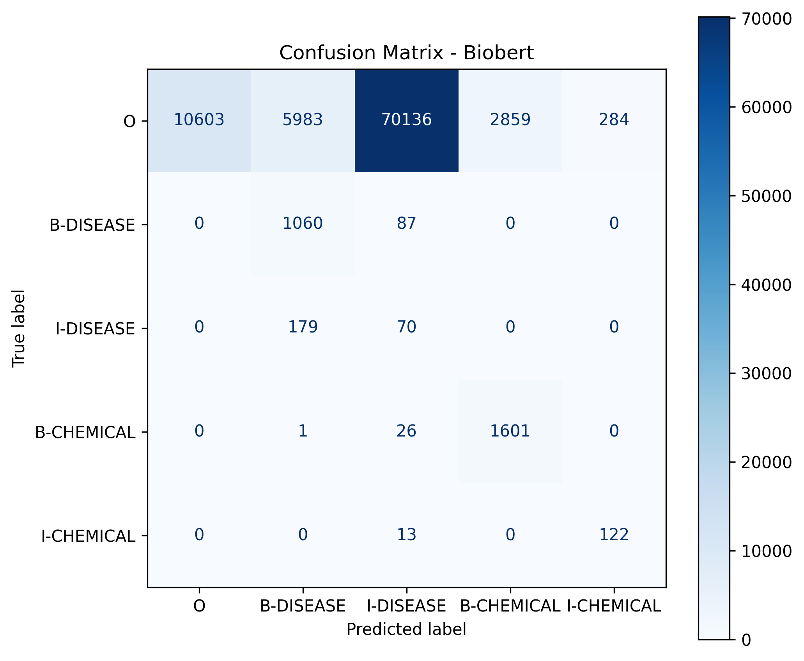

[](https://doi.org/10.5281/zenodo.18928352)

# Spatial Human Anatomy — Biomedical NER Benchmarking with Human Gold and Pseudo-Gold

This repository presents a **biomedical named entity recognition (NER) benchmarking study** using the **BC5CDR** dataset. The project focuses on extraction of **DISEASE** and **CHEMICAL** entities and evaluates several NER systems against both:

- **human gold annotations**
- **pseudo-gold annotations** constructed via multi-model agreement

The work is designed as a reproducible foundation for later research in **clinical knowledge graph construction**, **structured biomedical information extraction**, and **clinical AI**.

---

# Overview

Clinical and biomedical narratives contain valuable information, but that information is typically stored as unstructured text. A core step in turning such text into usable clinical knowledge is identifying entities such as diseases and chemicals. This repository implements an end-to-end pipeline for:

- parsing the BC5CDR corpus
- building **human gold BIO labels**
- running multiple NER systems
- constructing **pseudo-gold annotations** through majority voting
- benchmarking models with **seqeval**
- generating performance plots, per-label tables, confusion matrices, and runtime figures

---

# Research Contributions

This repository provides:

- an end-to-end biomedical NER pipeline
- benchmarking across **five NER systems**
- comparison against **human gold** and **pseudo-gold**
- BIO conversion and evaluation with **seqeval**
- per-label analysis for **DISEASE** and **CHEMICAL**
- confusion matrix analysis
- runtime benchmarking
- reproducible scripts and logged outputs

---

# Dataset

## BC5CDR

This study uses the **BC5CDR (BioCreative V Chemical-Disease Relation)** dataset, a widely used biomedical benchmark containing expert-annotated:

- **DISEASE** entities
- **CHEMICAL** entities

BC5CDR is particularly useful because it supports evaluation against **human gold annotations**, unlike weakly labeled or scraped alternatives.

---

# Models Evaluated

## 1. SciSpacy
Model:
- `en_ner_bc5cdr_md`

Characteristics:
- fastest model in this project
- strongest overall performance
- high precision and high recall

## 2. BioBERT
Pipeline:
- disease model: `alvaroalon2/biobert_diseases_ner`
- chemical model: `alvaroalon2/biobert_chemical_ner`

Characteristics:
- hybrid BioBERT-based pipeline
- strong chemical extraction relative to disease extraction
- moderate runtime

## 3. PubMedBERT
Pipeline:
- disease model: `sarahmiller137/BiomedNLP-PubMedBERT-base-uncased-abstract-fulltext-ft-ncbi-disease`
- chemical model: `OpenMed/OpenMed-NER-ChemicalDetect-PubMed-335M`

Characteristics:
- strong chemical recognition
- weak disease performance in this setup
- slowest runtime

## 4. ClinicalBERT
Model:
- `samrawal/bert-base-uncased_clinical-ner`

Characteristics:
- designed for clinical narratives
- relatively high recall
- tends to over-predict entities

## 5. BioELECTRA
Model:
- `d4data/biomedical-ner-all`

Characteristics:
- balanced precision-recall trade-off
- efficient runtime
- stronger overall balance than ClinicalBERT in this study

---

# Project Pipeline

```text
BC5CDR Raw PubTator Files
↓
Dataset Parsing
↓
BC5CDR docs/entities JSONL files
↓
Human Gold BIO Construction
↓
NER Prediction with 5 Models
├── SciSpacy
├── BioBERT
├── PubMedBERT
├── ClinicalBERT
└── BioELECTRA
↓
Pseudo-Gold Construction (majority voting, ≥ 3 votes)
↓
Benchmark Evaluation
├── Pseudo-Gold vs Human Gold
├── Models vs Human Gold
└── Models vs Pseudo-Gold
↓
Figures, confusion matrices, per-label tables, and runtime plots
```

---

# Human Gold and Pseudo-Gold

## Human Gold

Human gold annotations are derived directly from BC5CDR and converted into **BIO format** for evaluation.

Main file:
- `data/gold/bc5cdr_train_gold_bio.jsonl`

## Pseudo-Gold

Pseudo-gold annotations are constructed through **majority voting** across model predictions.

### Voting setup

The pseudo-gold construction uses predictions from:

- SciSpacy
- BioBERT
- PubMedBERT
- ClinicalBERT
- BioELECTRA

An entity is retained when:

- **at least 3 models agree**

Main evaluation file:
- `data/gold/candidate_gold_train_entities_bc5cdr.jsonl`

Additional gold directory file present in the project:
- `data/gold/candidate_gold_entities.jsonl`

---

# Repository Structure

```text
data/
├── gold/
│   ├── bc5cdr_train_gold_bio.jsonl
│   └── candidate_gold_train_entities_bc5cdr.jsonl
├── processed/
│   └── bc5cdr/
│       ├── bc5cdr_dev_docs.jsonl
│       ├── bc5cdr_dev_entities.jsonl
│       ├── bc5cdr_test_docs.jsonl
│       ├── bc5cdr_test_entities.jsonl
│       ├── bc5cdr_train_docs.jsonl
│       ├── bc5cdr_train_entities.jsonl
│       ├── biobert_train_entities_bc5cdr.jsonl
│       ├── bioelectra_train_entities_bc5cdr.jsonl
│       ├── clinicalbert_train_entities_bc5cdr.jsonl
│       ├── clinicalbert_train_entities_bc5cdr_clean.jsonl
│       ├── pubmedbert_train_entities_bc5cdr.jsonl
│       └── scispacy_train_entities_bc5cdr.jsonl

figure/
├── candidate_vs_human_performance.png
├── confusion_matrix_biobert.png
├── confusion_matrix_bioelectra.png
├── confusion_matrix_candidate_biobert.png
├── confusion_matrix_candidate_bioelectra.png
├── confusion_matrix_candidate_clinicalbert.png
├── confusion_matrix_candidate_pubmedbert.png
├── confusion_matrix_candidate_scispacy.png
├── confusion_matrix_candidate_vs_human.png
├── confusion_matrix_clinicalbert.png
├── confusion_matrix_human_biobert.png
├── confusion_matrix_human_bioelectra.png
├── confusion_matrix_human_clinicalbert.png
├── confusion_matrix_human_pubmedbert.png
├── confusion_matrix_human_scispacy.png
├── confusion_matrix_pubmedbert.png
├── confusion_matrix_scispacy.png
├── model_performance_candidate_gold.png
├── model_performance_comparison.png
├── model_performance_human_gold.png
├── model_runtime_candidate_gold.png
├── model_runtime_comparison.png
├── model_runtime_human_gold.png
├── per_label_performance.png
├── per_label_performance_candidate_gold.png
└── per_label_performance_human_gold.png

logs/
└── evaluation.log

src/
├── __init__.py
├── bc5cdr_evaluation.py
├── biobert_bc5cdr.py
├── bioelectra_bc5cdr.py
├── build_gold_bc5cdr.py
├── candidate_gold.py
├── clinicalbert_bc5cdr.py
├── graph.py
├── parse_bc5cdr.py
├── pubmed_bc5cdr.py
├── scispacy_bc5cdr.py
└── utils.py
```

---

# Installation

## 1. Create and activate a virtual environment

### Windows
```bash
python -m venv .venv
.venv\Scripts\activate
```

## 2. Install dependencies

```bash
pip install -r requirements/base.txt
pip install -r requirements/torch.txt
```

Optional:
```bash
pip install -r requirements/dev.txt
```

---

# Running the Project

## Step 1 — Parse BC5CDR

```bash
python -m src.parse_bc5cdr
```

This produces parsed document and entity JSONL files for train, dev, and test sets.

## Step 2 — Build Human Gold BIO Labels

```bash
python -m src.build_gold_bc5cdr
```

This creates:

- `data/gold/bc5cdr_train_gold_bio.jsonl`

## Step 3 — Run NER Models

```bash
python -m src.scispacy_bc5cdr
python -m src.biobert_bc5cdr
python -m src.pubmed_bc5cdr
python -m src.clinicalbert_bc5cdr
python -m src.bioelectra_bc5cdr
```

These generate model prediction files in:

- `data/processed/bc5cdr/`

## Step 4 — Build Pseudo-Gold

```bash
python -m src.candidate_gold
```

This creates the pseudo-gold entity file used in evaluation.

## Step 5 — Run Evaluation

```bash
python -m src.bc5cdr_evaluation
```

This produces:

- overall performance summaries
- per-label metrics
- confusion matrices
- runtime figures
- saved plots in `figure/`

---

# Logging

To save evaluation output:

```bash
python -m src.bc5cdr_evaluation > logs/evaluation.log
```

To save model logs individually:

```bash
python -m src.scispacy_bc5cdr > logs/scispacy.log
python -m src.biobert_bc5cdr > logs/biobert.log
python -m src.pubmed_bc5cdr > logs/pubmedbert.log
python -m src.clinicalbert_bc5cdr > logs/clinicalbert.log
python -m src.bioelectra_bc5cdr > logs/bioelectra.log
python -m src.candidate_gold > logs/candidate_gold.log
python -m src.bc5cdr_evaluation > logs/evaluation.log
```

---

# Main Results

## Pseudo-Gold vs Human Gold

Final evaluation:

- Precision: **0.9308**
- Recall: **0.5397**
- F1-score: **0.6832**

Interpretation:

- very high precision indicates that pseudo-gold annotations are **high-confidence**
- lower recall shows that pseudo-gold is **conservative**
- majority voting captures reliable entities but misses harder cases

### Figure


### Confusion Matrix


---

# Model Performance vs Human Gold

| Model | Precision | Recall | F1-score |
|------|----------:|-------:|---------:|
| SciSpacy | 0.9334 | 0.8613 | 0.8959 |
| BioBERT | 0.3474 | 0.6485 | 0.4525 |
| PubMedBERT | 0.3057 | 0.5842 | 0.4014 |
| ClinicalBERT | 0.2987 | 0.4247 | 0.3507 |
| BioELECTRA | 0.4855 | 0.4448 | 0.4642 |

### Figure


### Additional legacy comparison figure


---

# Model Performance vs Pseudo-Gold

| Model | Precision | Recall | F1-score |
|------|----------:|-------:|---------:|
| SciSpacy | 0.5761 | 0.9169 | 0.7076 |
| BioBERT | 0.2376 | 0.7650 | 0.3626 |
| PubMedBERT | 0.2051 | 0.6760 | 0.3147 |
| ClinicalBERT | 0.2646 | 0.6488 | 0.3759 |
| BioELECTRA | 0.3832 | 0.6054 | 0.4693 |

### Figure


---

# Per-Label Performance vs Human Gold

| Model | Label | Precision | Recall | F1-score | Support |
|------|------|----------:|-------:|---------:|--------:|
| SciSpacy | DISEASE | 0.9290 | 0.8988 | 0.9137 | 4180 |
| SciSpacy | CHEMICAL | 0.9374 | 0.8308 | 0.8809 | 5135 |
| BioBERT | DISEASE | 0.1795 | 0.5278 | 0.2679 | 4180 |
| BioBERT | CHEMICAL | 0.7521 | 0.7468 | 0.7495 | 5135 |
| PubMedBERT | DISEASE | 0.0852 | 0.2541 | 0.1276 | 4180 |
| PubMedBERT | CHEMICAL | 0.8202 | 0.8530 | 0.8363 | 5135 |
| ClinicalBERT | DISEASE | 0.2454 | 0.4318 | 0.3129 | 4180 |
| ClinicalBERT | CHEMICAL | 0.3654 | 0.4189 | 0.3903 | 5135 |
| BioELECTRA | DISEASE | 0.3824 | 0.4014 | 0.3917 | 4180 |
| BioELECTRA | CHEMICAL | 0.5945 | 0.4800 | 0.5312 | 5135 |

### Figure


### Additional legacy table figure


---

# Per-Label Performance vs Pseudo-Gold

| Model | Label | Precision | Recall | F1-score | Support |
|------|------|----------:|-------:|---------:|--------:|
| SciSpacy | DISEASE | 0.5687 | 0.9237 | 0.7040 | 2490 |
| SciSpacy | CHEMICAL | 0.5827 | 0.9110 | 0.7108 | 2911 |
| BioBERT | DISEASE | 0.1189 | 0.5867 | 0.1977 | 2490 |
| BioBERT | CHEMICAL | 0.5238 | 0.9176 | 0.6669 | 2911 |
| PubMedBERT | DISEASE | 0.0697 | 0.3490 | 0.1163 | 2490 |
| PubMedBERT | CHEMICAL | 0.5210 | 0.9557 | 0.6743 | 2911 |
| ClinicalBERT | DISEASE | 0.2276 | 0.6723 | 0.3400 | 2490 |
| ClinicalBERT | CHEMICAL | 0.3109 | 0.6286 | 0.4160 | 2911 |
| BioELECTRA | DISEASE | 0.3108 | 0.5478 | 0.3966 | 2490 |
| BioELECTRA | CHEMICAL | 0.4597 | 0.6548 | 0.5402 | 2911 |

### Figure


---

# Runtime Analysis

## Final average runtime per note

| Model | Avg Runtime per Note (seconds) |
|------|-------------------------------:|
| SciSpacy | 0.0238 |
| BioBERT | 0.4634 |
| PubMedBERT | 3.4778 |
| ClinicalBERT | 0.2107 |
| BioELECTRA | 0.1267 |

Interpretation:

- **SciSpacy** is the fastest model by a large margin
- **PubMedBERT** is the slowest model
- **BioELECTRA** offers a strong balance between speed and performance
- **BioBERT** is substantially faster than PubMedBERT in this setup

### Figures


### Additional legacy comparison figure


---

# Confusion Matrices

## Pseudo-Gold vs Human Gold


## SciSpacy vs Human Gold


## BioBERT vs Human Gold


## PubMedBERT vs Human Gold


## ClinicalBERT vs Human Gold


## BioELECTRA vs Human Gold


## SciSpacy vs Pseudo-Gold


## BioBERT vs Pseudo-Gold


## PubMedBERT vs Pseudo-Gold


## ClinicalBERT vs Pseudo-Gold


## BioELECTRA vs Pseudo-Gold


## Additional legacy confusion matrices





---

# Key Findings

- **SciSpacy** is the strongest overall model in this study
- **Pseudo-gold annotations** are high precision but conservative
- **Chemical entities** are easier to detect consistently than disease entities
- **PubMedBERT** shows strong chemical recognition but weak disease recognition
- **ClinicalBERT** tends to over-predict entity spans
- **BioELECTRA** provides the best balance among transformer-based models

---

# Important Methodological Note

The pseudo-gold annotations are **consensus-based references**, not replacements for human ground truth. They are intended as supplementary evaluation resources. Because pseudo-gold is built from model agreement, it should be interpreted as a **high-confidence but incomplete annotation layer**.

---

# Future Work

Planned extensions include:

- entity normalization with UMLS / MeSH / SNOMED
- relation extraction
- clinical knowledge graph construction
- graph-based reasoning over extracted biomedical entities
- benchmarking newer models such as LLaMA, BioGPT, and other biomedical foundation models

---

# License
This project is licensed under the MIT License. See [LICENSE](LICENSE) for details.
---

# Repository

GitHub:
`https://github.com/kazx22/spatial-human-anatomy`
