[](https://doi.org/10.5281/zenodo.18928352)

# Spatial Human Anatomy — Biomedical NER Benchmarking on BC5CDR

This repository presents a **reproducible biomedical named entity recognition (NER) benchmarking study** using the **BC5CDR** corpus. Five NER systems are evaluated on extraction of **DISEASE** and **CHEMICAL** entities against two reference standards:

- **human gold annotations** derived directly from BC5CDR
- **pseudo-gold annotations** constructed via multi-model majority voting

The work forms a reproducible foundation for future research in **clinical knowledge graph construction**, **structured biomedical information extraction**, and **clinical AI**.

---

# Overview

Biomedical narratives contain large amounts of clinical knowledge stored as unstructured text. Identifying entities such as diseases and chemicals is a critical first step toward structured knowledge extraction. This repository implements an end-to-end pipeline covering:

- parsing the BC5CDR corpus into document and entity JSONL files
- building **human gold BIO labels** from expert annotations
- running five NER systems with proper long-document chunking
- constructing **pseudo-gold annotations** through majority voting (≥ 3 of 5 models)
- benchmarking all models with **seqeval** against both reference standards
- generating performance plots, per-label tables, confusion matrices, and runtime figures

---

# Research Contributions

- end-to-end biomedical NER pipeline evaluated on a standard benchmark
- comparison of **five NER systems** spanning rule-based, transformer, and clinical models
- dual evaluation against **human gold** and **pseudo-gold** reference standards
- analysis of pseudo-gold quality against human annotations (P: 0.93, R: 0.54, F1: 0.68)
- per-label breakdown for **DISEASE** and **CHEMICAL** entity types
- confusion matrix analysis and runtime benchmarking across all models

---

# Dataset

This study uses the **BC5CDR (BioCreative V Chemical-Disease Relation)** corpus, a widely used biomedical NER benchmark with expert-annotated DISEASE and CHEMICAL entities across 1,500 PubMed abstracts with train, development, and test splits.

**Citation:**

> Li, J., Sun, Y., Johnson, R. J., Sciaky, D., Wei, C. H., Leaman, R., ... & Lu, Z. (2016). BioCreative V CDR task corpus: a resource for chemical disease relation extraction. _Database_, 2016.

BC5CDR is available from the [BioCreative V challenge page](https://biocreative.bioinformatics.udel.edu/tasks/biocreative-v/track-3-cdr/). The raw corpus files are not redistributed in this repository.

---

# Models Evaluated

## 1. SciSpacy

Model: `en_ner_bc5cdr_md`

- fastest model in the study (0.024s per note)
- strongest overall F1 against human gold (0.896)
- high precision and recall across both entity types

## 2. BioBERT

Disease model: `alvaroalon2/biobert_diseases_ner`
Chemical model: `alvaroalon2/biobert_chemical_ner`

- hybrid dual-pipeline approach
- strong chemical recognition (F1: 0.750), weaker disease recognition (F1: 0.268)
- moderate runtime (0.46s per note)

## 3. PubMedBERT

Disease model: `sarahmiller137/BiomedNLP-PubMedBERT-base-uncased-abstract-fulltext-ft-ncbi-disease`
Chemical model: `OpenMed/OpenMed-NER-ChemicalDetect-PubMed-335M`

- strong chemical recognition (F1: 0.836) but weak disease recognition (F1: 0.128)
- slowest model by a large margin (3.48s per note)

## 4. ClinicalBERT

Model: `samrawal/bert-base-uncased_clinical-ner`

- designed for clinical narratives
- tends to over-predict entity spans, leading to low precision
- TEST labels filtered from output before evaluation

## 5. BioELECTRA

Model: `d4data/biomedical-ner-all`

- best precision-recall balance among transformer models
- efficient runtime (0.13s per note)
- label mapping: `Disease_disorder` → DISEASE, `Medication` / `Therapeutic_procedure` → CHEMICAL

---

# Project Pipeline

```text
BC5CDR Raw PubTator Files
↓
Dataset Parsing  (parse_bc5cdr.py)
↓
BC5CDR docs/entities JSONL files
↓
Human Gold BIO Construction  (build_gold_bc5cdr.py)
↓
NER Prediction — 5 Models
├── SciSpacy          (scispacy_bc5cdr.py)
├── BioBERT           (biobert_bc5cdr.py)
├── PubMedBERT        (pubmed_bc5cdr.py)
├── ClinicalBERT      (clinicalbert_bc5cdr.py)
└── BioELECTRA        (bioelectra_bc5cdr.py)
↓
Pseudo-Gold Construction — majority voting ≥ 3/5  (candidate_gold.py)
↓
Benchmark Evaluation  (bc5cdr_evaluation.py)
├── Pseudo-Gold vs Human Gold
├── Models vs Human Gold
└── Models vs Pseudo-Gold
↓
Figures, confusion matrices, per-label tables, runtime plots  (graph.py)
```

---

# Human Gold and Pseudo-Gold

## Human Gold

Human gold annotations are derived directly from BC5CDR expert annotations and converted to **BIO token format** for sequence evaluation.

Output file: `data/gold/bc5cdr_train_gold_bio.jsonl`

## Pseudo-Gold

Pseudo-gold annotations are constructed by majority voting across all five model predictions. An entity is retained when **at least 3 of 5 models agree** on the same span and label.

Output file: `data/gold/candidate_gold_train_entities_bc5cdr.jsonl`

The pseudo-gold achieves high precision (0.93) against human gold, confirming that agreed-upon entities are reliable. Lower recall (0.54) reflects its conservative nature — harder or ambiguous entities are excluded.

---

# Repository Structure

```text
data/
├── gold/
│   ├── bc5cdr_train_gold_bio.jsonl
│   └── candidate_gold_train_entities_bc5cdr.jsonl
├── processed/
│   └── bc5cdr/
│       ├── bc5cdr_train_docs.jsonl
│       ├── bc5cdr_train_entities.jsonl
│       ├── bc5cdr_dev_docs.jsonl
│       ├── bc5cdr_dev_entities.jsonl
│       ├── bc5cdr_test_docs.jsonl
│       ├── bc5cdr_test_entities.jsonl
│       ├── scispacy_train_entities_bc5cdr.jsonl
│       ├── biobert_train_entities_bc5cdr.jsonl
│       ├── pubmedbert_train_entities_bc5cdr.jsonl
│       ├── clinicalbert_train_entities_bc5cdr.jsonl
│       ├── clinicalbert_train_entities_bc5cdr_clean.jsonl
│       └── bioelectra_train_entities_bc5cdr.jsonl

figure/
├── candidate_vs_human_performance.png
├── confusion_matrix_candidate_vs_human.png
├── model_performance_human_gold.png
├── model_performance_candidate_gold.png
├── model_runtime_human_gold.png
├── model_runtime_candidate_gold.png
├── per_label_performance_human_gold.png
├── per_label_performance_candidate_gold.png
├── confusion_matrix_human_scispacy.png
├── confusion_matrix_human_biobert.png
├── confusion_matrix_human_pubmedbert.png
├── confusion_matrix_human_clinicalbert.png
├── confusion_matrix_human_bioelectra.png
├── confusion_matrix_candidate_scispacy.png
├── confusion_matrix_candidate_biobert.png
├── confusion_matrix_candidate_pubmedbert.png
├── confusion_matrix_candidate_clinicalbert.png
└── confusion_matrix_candidate_bioelectra.png

logs/
└── evaluation.log

src/
├── __init__.py
├── bc5cdr_evaluation.py
├── biobert_bc5cdr.py
├── bioelectra_bc5cdr.py
├── build_gold_bc5cdr.py
├── candidate_gold.py
├── clinicalbert_bc5cdr.py
├── graph.py
├── parse_bc5cdr.py
├── pubmed_bc5cdr.py
├── scispacy_bc5cdr.py
└── utils.py
```

---

# Installation

## 1. Create and activate a virtual environment

```bash
python -m venv .venv
.venv\Scripts\activate        # Windows
source .venv/bin/activate     # macOS / Linux
```

## 2. Install dependencies

```bash
pip install -r requirements/base.txt
pip install -r requirements/torch.txt
```

Optional development dependencies:

```bash
pip install -r requirements/dev.txt
```

---

# Running the Project

## Step 1 — Obtain BC5CDR data

Download the raw PubTator files from the [BioCreative V CDR task page](https://biocreative.bioinformatics.udel.edu/tasks/biocreative-v/track-3-cdr/) and place them in `data/raw/bc5cdr/`:

```
data/raw/bc5cdr/
├── CDR_TrainingSet.PubTator.txt
├── CDR_DevelopmentSet.PubTator.txt
└── CDR_TestSet.PubTator.txt
```

## Step 2 — Parse BC5CDR

```bash
python -m src.parse_bc5cdr
```

Produces parsed document and entity JSONL files for train, dev, and test splits.

## Step 3 — Build Human Gold BIO Labels

```bash
python -m src.build_gold_bc5cdr
```

Produces: `data/gold/bc5cdr_train_gold_bio.jsonl`

## Step 4 — Run NER Models

```bash
python -m src.scispacy_bc5cdr
python -m src.biobert_bc5cdr
python -m src.pubmed_bc5cdr
python -m src.clinicalbert_bc5cdr
python -m src.bioelectra_bc5cdr
```

Model predictions are saved to `data/processed/bc5cdr/`.

## Step 5 — Build Pseudo-Gold

```bash
python -m src.candidate_gold
```

## Step 6 — Run Evaluation

```bash
python -m src.bc5cdr_evaluation
```

Produces performance summaries, per-label metrics, confusion matrices, and all figures saved to `figure/`.

---

# Logging

```bash
python -m src.bc5cdr_evaluation > logs/evaluation.log

# Individual model logs
python -m src.scispacy_bc5cdr    > logs/scispacy.log
python -m src.biobert_bc5cdr     > logs/biobert.log
python -m src.pubmed_bc5cdr      > logs/pubmedbert.log
python -m src.clinicalbert_bc5cdr > logs/clinicalbert.log
python -m src.bioelectra_bc5cdr  > logs/bioelectra.log
python -m src.candidate_gold     > logs/candidate_gold.log
```

---

# Results

> **Note:** All results below are reported on the **BC5CDR training split**. Evaluation on the held-out test split is planned for the next phase of this work.

## Pseudo-Gold vs Human Gold

| Metric    |      Score |
| --------- | ---------: |
| Precision | **0.9308** |
| Recall    | **0.5397** |
| F1-score  | **0.6832** |

High precision confirms that pseudo-gold entities are reliable where models agree. Lower recall reflects the conservative nature of majority voting — ambiguous or harder entities are excluded by design.

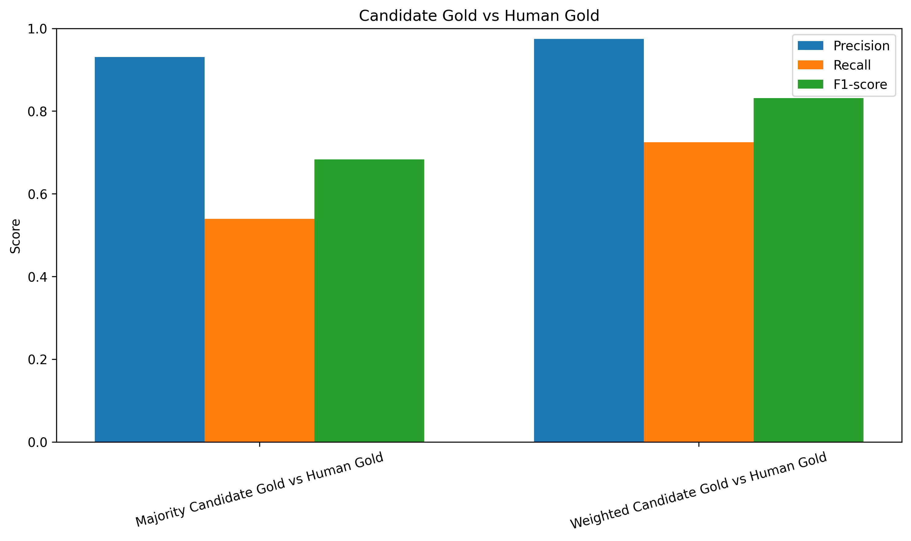


---

## Model Performance vs Human Gold

| Model        | Precision | Recall |   F1-score |
| ------------ | --------: | -----: | ---------: |
| SciSpacy     |    0.9334 | 0.8613 | **0.8959** |
| BioELECTRA   |    0.4855 | 0.4448 |     0.4642 |
| BioBERT      |    0.3474 | 0.6485 |     0.4525 |
| PubMedBERT   |    0.3057 | 0.5842 |     0.4014 |
| ClinicalBERT |    0.2987 | 0.4247 |     0.3507 |

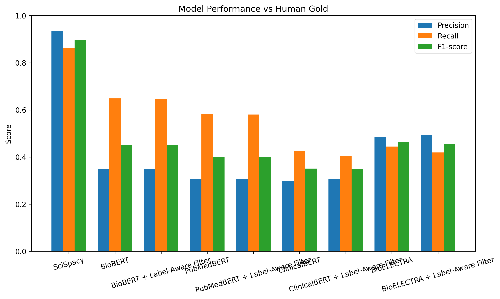

---

## Model Performance vs Pseudo-Gold

| Model        | Precision | Recall |   F1-score |
| ------------ | --------: | -----: | ---------: |
| SciSpacy     |    0.5761 | 0.9169 | **0.7076** |
| BioELECTRA   |    0.3832 | 0.6054 |     0.4693 |
| ClinicalBERT |    0.2646 | 0.6488 |     0.3759 |
| BioBERT      |    0.2376 | 0.7650 |     0.3626 |
| PubMedBERT   |    0.2051 | 0.6760 |     0.3147 |

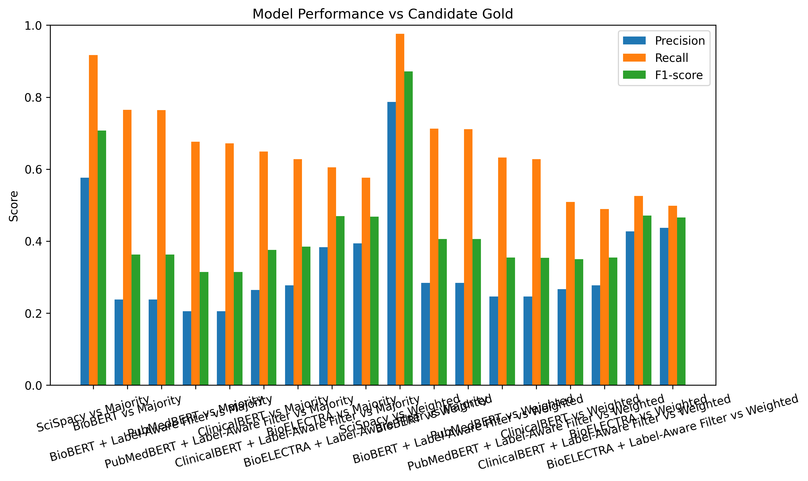

---

## Per-Label Performance vs Human Gold

| Model        | Label    | Precision | Recall | F1-score | Support |
| ------------ | -------- | --------: | -----: | -------: | ------: |
| SciSpacy     | DISEASE  |    0.9290 | 0.8988 |   0.9137 |    4180 |
| SciSpacy     | CHEMICAL |    0.9374 | 0.8308 |   0.8809 |    5135 |
| BioBERT      | DISEASE  |    0.1795 | 0.5278 |   0.2679 |    4180 |
| BioBERT      | CHEMICAL |    0.7521 | 0.7468 |   0.7495 |    5135 |
| PubMedBERT   | DISEASE  |    0.0852 | 0.2541 |   0.1276 |    4180 |
| PubMedBERT   | CHEMICAL |    0.8202 | 0.8530 |   0.8363 |    5135 |
| ClinicalBERT | DISEASE  |    0.2454 | 0.4318 |   0.3129 |    4180 |
| ClinicalBERT | CHEMICAL |    0.3654 | 0.4189 |   0.3903 |    5135 |
| BioELECTRA   | DISEASE  |    0.3824 | 0.4014 |   0.3917 |    4180 |
| BioELECTRA   | CHEMICAL |    0.5945 | 0.4800 |   0.5312 |    5135 |

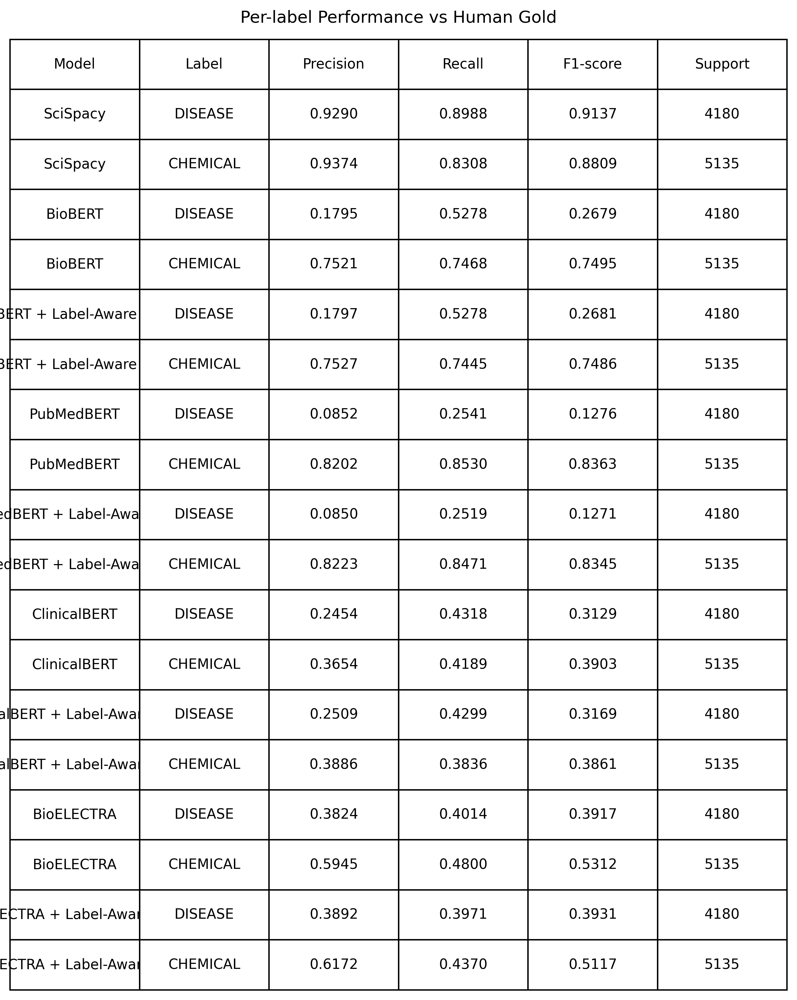

---

## Per-Label Performance vs Pseudo-Gold

| Model        | Label    | Precision | Recall | F1-score | Support |
| ------------ | -------- | --------: | -----: | -------: | ------: |
| SciSpacy     | DISEASE  |    0.5687 | 0.9237 |   0.7040 |    2490 |
| SciSpacy     | CHEMICAL |    0.5827 | 0.9110 |   0.7108 |    2911 |
| BioBERT      | DISEASE  |    0.1189 | 0.5867 |   0.1977 |    2490 |
| BioBERT      | CHEMICAL |    0.5238 | 0.9176 |   0.6669 |    2911 |
| PubMedBERT   | DISEASE  |    0.0697 | 0.3490 |   0.1163 |    2490 |
| PubMedBERT   | CHEMICAL |    0.5210 | 0.9557 |   0.6743 |    2911 |
| ClinicalBERT | DISEASE  |    0.2276 | 0.6723 |   0.3400 |    2490 |
| ClinicalBERT | CHEMICAL |    0.3109 | 0.6286 |   0.4160 |    2911 |
| BioELECTRA   | DISEASE  |    0.3108 | 0.5478 |   0.3966 |    2490 |
| BioELECTRA   | CHEMICAL |    0.4597 | 0.6548 |   0.5402 |    2911 |

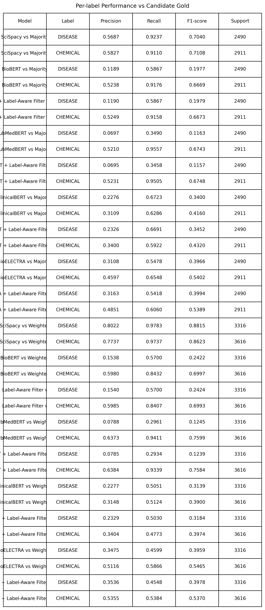

---

## Runtime Analysis

| Model        | Avg Runtime per Note (s) |
| ------------ | -----------------------: |
| SciSpacy     |                   0.0238 |
| BioELECTRA   |                   0.1267 |
| ClinicalBERT |                   0.2107 |
| BioBERT      |                   0.4634 |
| PubMedBERT   |                   3.4778 |

SciSpacy is the fastest model by a large margin. BioELECTRA offers the strongest speed-performance balance among transformer models. PubMedBERT is the slowest due to its dual-pipeline design.

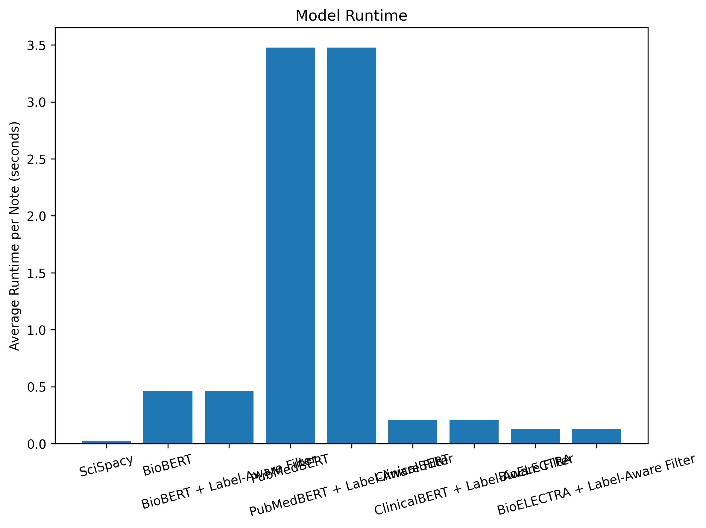
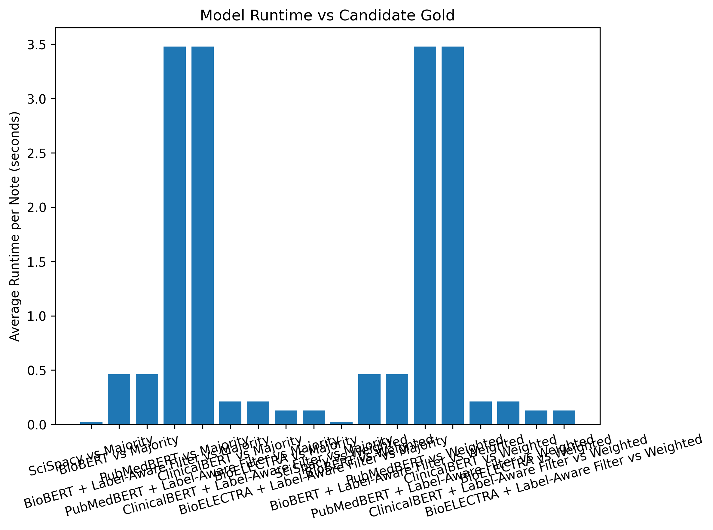

---

## Confusion Matrices

### Pseudo-Gold vs Human Gold


### Models vs Human Gold


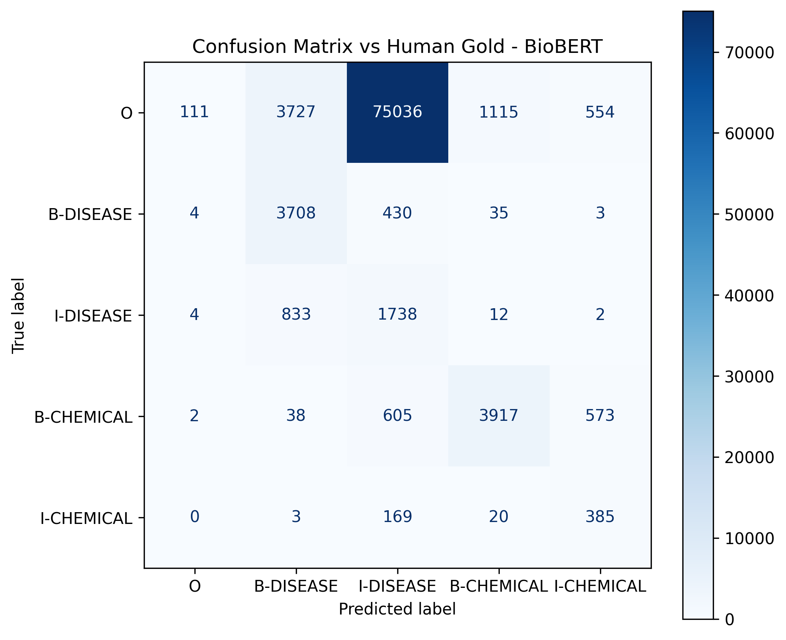

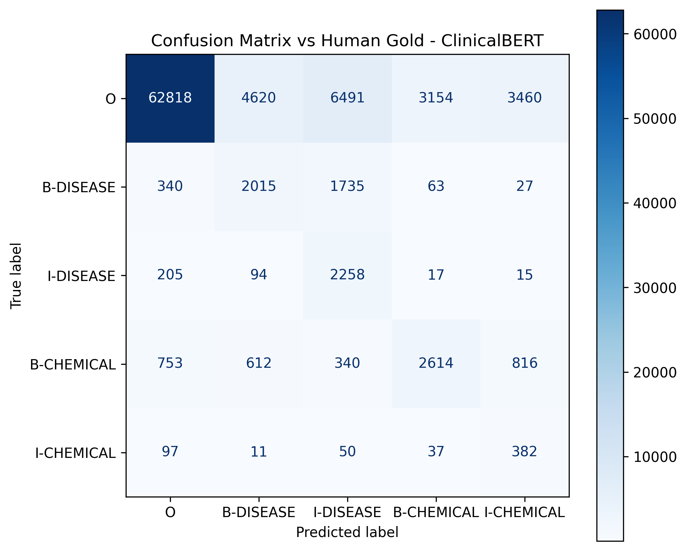
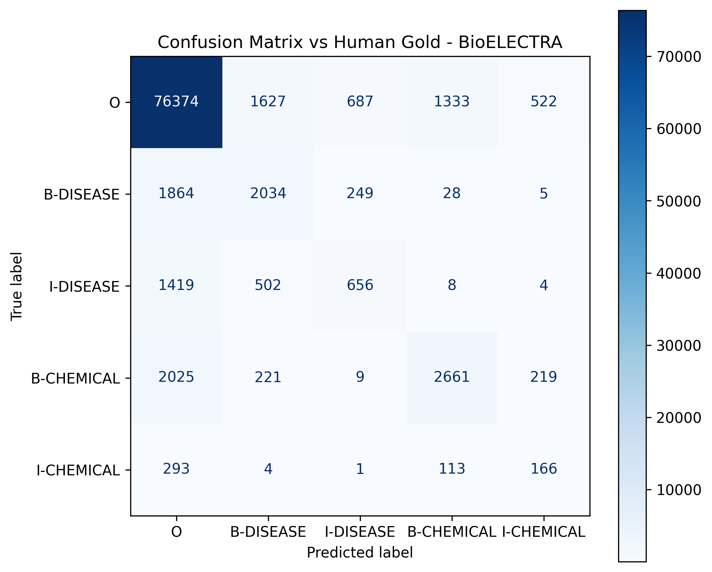

### Models vs Pseudo-Gold

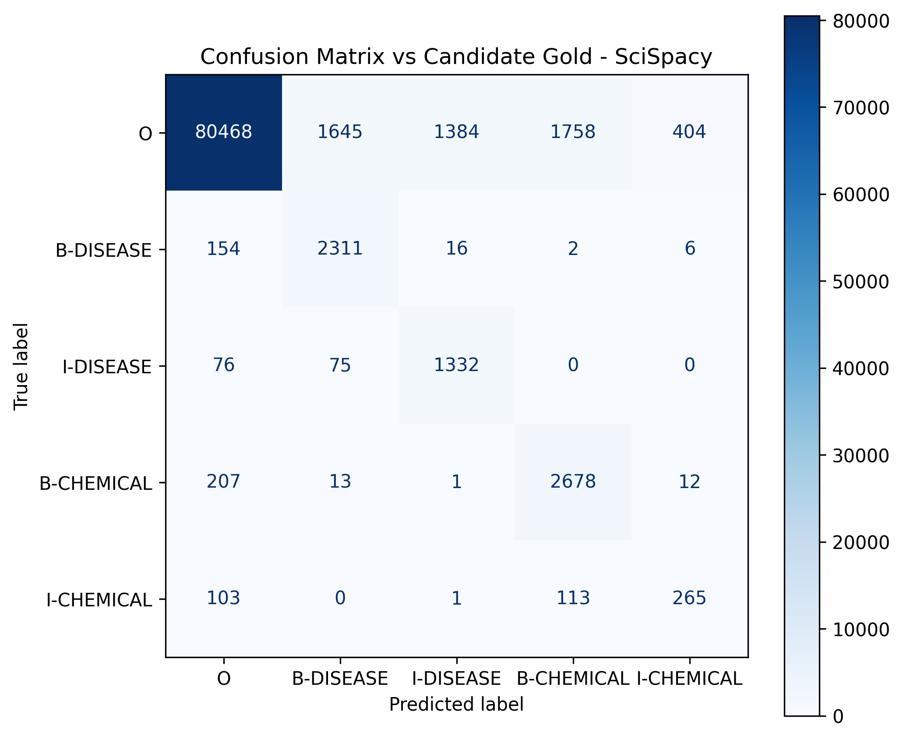
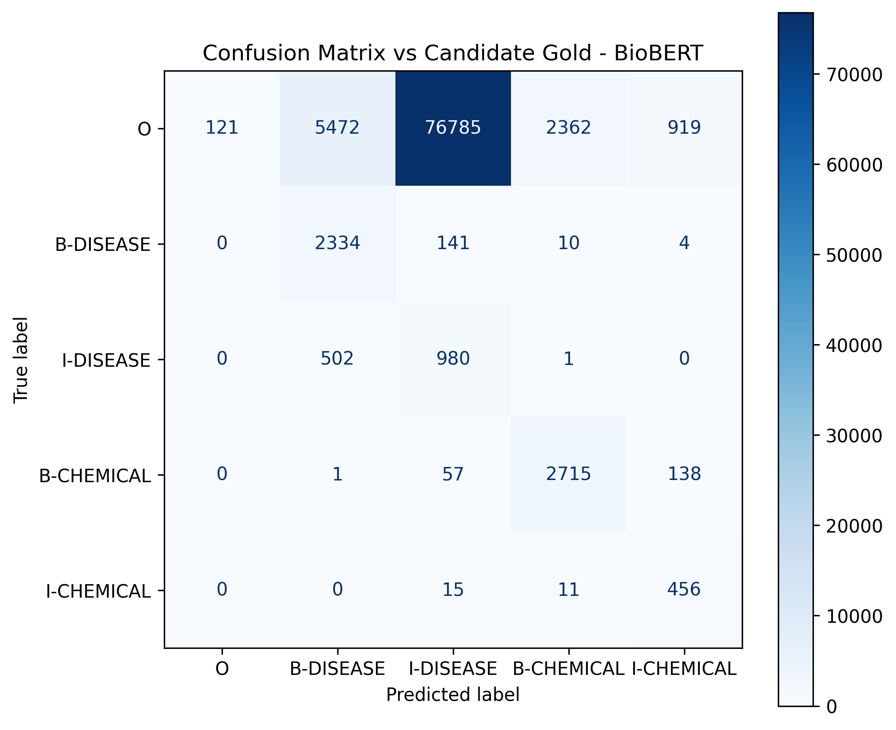
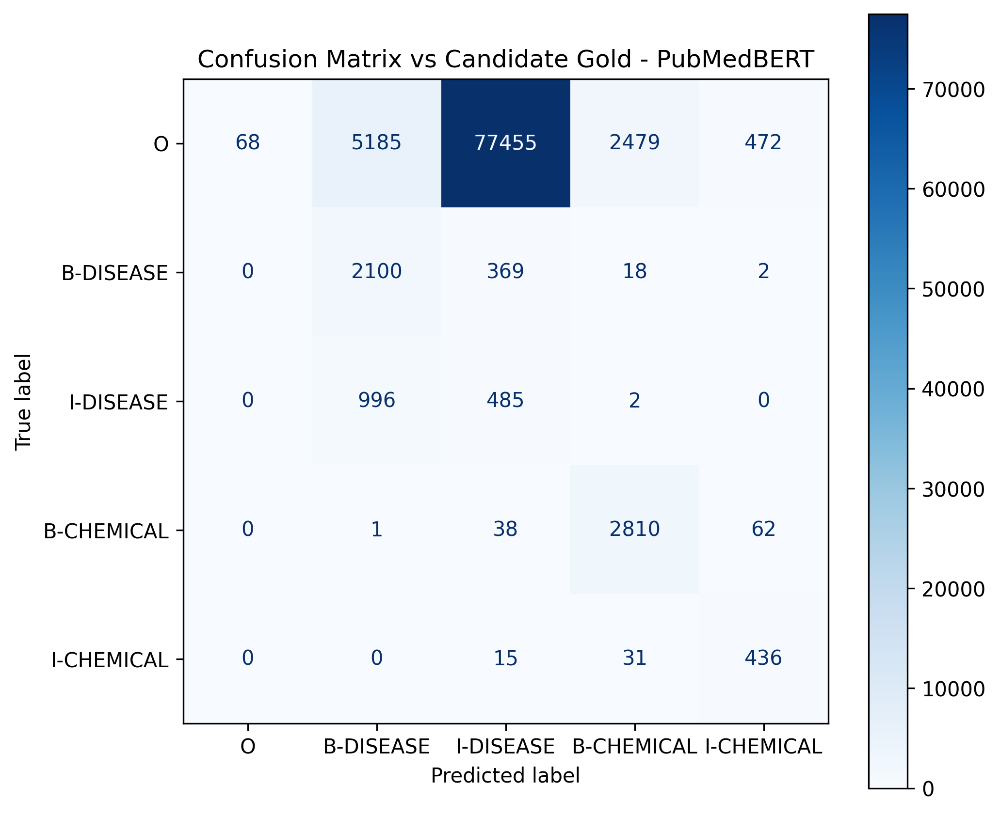
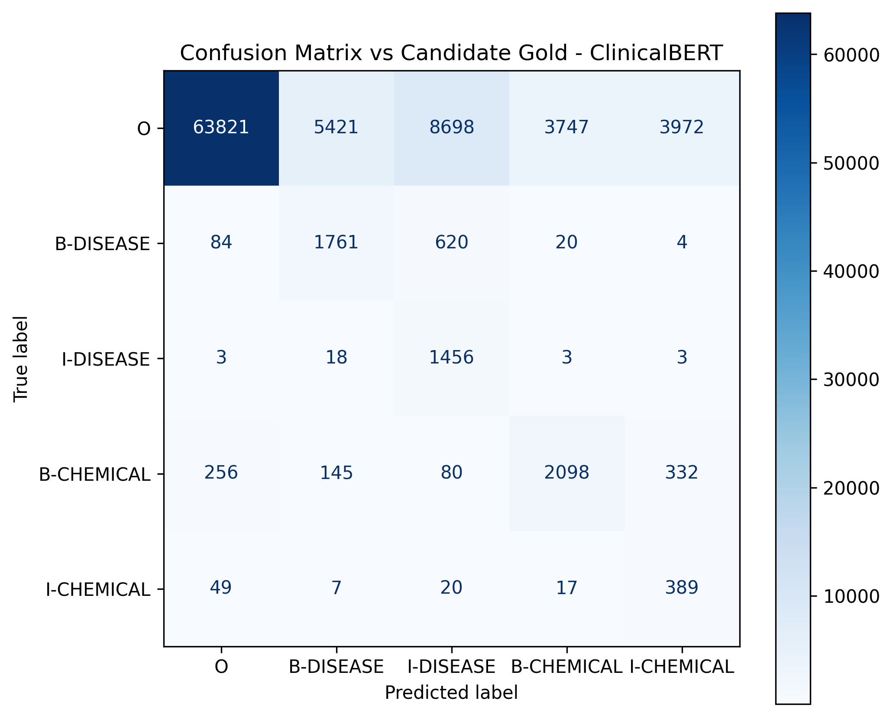


---

# Key Findings

- **SciSpacy** achieves the highest F1 against human gold (0.896) and is by far the fastest model, making it the most practical choice for large-scale extraction on BC5CDR-style data
- **Pseudo-gold annotations** are high precision but conservative — they capture reliable entities but miss harder cases
- **Chemical entities** are consistently easier to detect than disease entities across all transformer models
- **BioBERT and PubMedBERT** show a clear split: strong chemical recognition, weak disease recognition, suggesting the disease fine-tuning datasets used differ significantly from BC5CDR
- **BioELECTRA** provides the best balance among transformer models across both speed and F1
- **ClinicalBERT** over-predicts entity spans, performing better on clinical text than on biomedical abstracts

---

# Methodological Note

Pseudo-gold annotations are **consensus-based references**, not replacements for human ground truth. They serve as a supplementary evaluation layer to examine whether model agreement correlates with annotation quality. The high precision of pseudo-gold (0.93) against BC5CDR human annotations validates this approach for identifying high-confidence entities, while the lower recall (0.54) confirms it should not be treated as a complete annotation.

---

# Future Work

- evaluation on BC5CDR development and test splits
- entity normalization to UMLS, MeSH, and SNOMED CT
- relation extraction between chemical and disease entities
- clinical knowledge graph construction from extracted entities
- graph-based reasoning over biomedical entity networks
- benchmarking newer models including BioGPT, LLaMA-based biomedical variants, and instruction-tuned models

---

# License
<<<<<<< HEAD

This project is licensed under the MIT License. See [LICENSE](LICENSE) for details.

=======
This project is licensed under the MIT License. See [LICENSE](LICENSE) for details.
>>>>>>> 7672007cc35484eb8a63dff1cdca27637dd37160
---

# Repository

[https://github.com/kazx22/spatial-human-anatomy](https://github.com/kazx22/spatial-human-anatomy)
