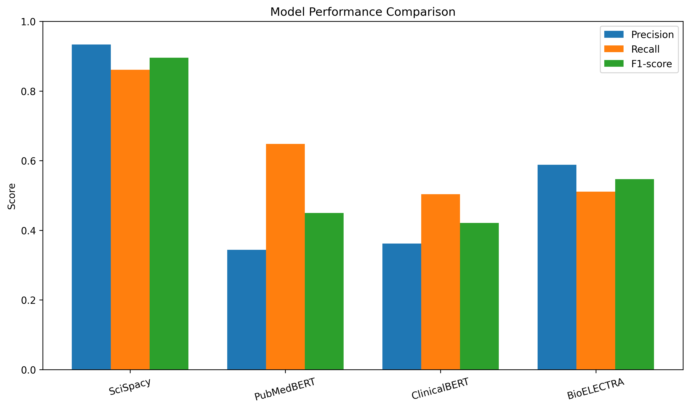
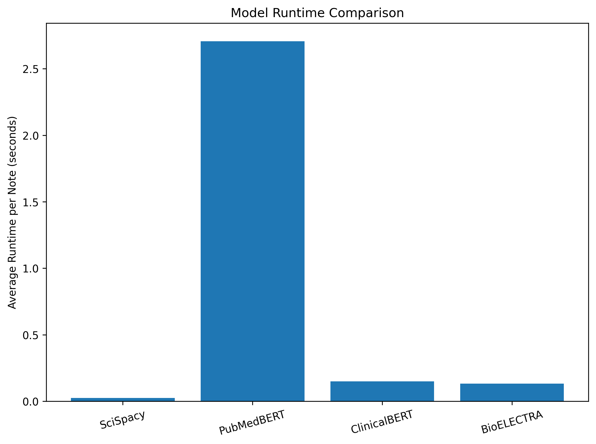
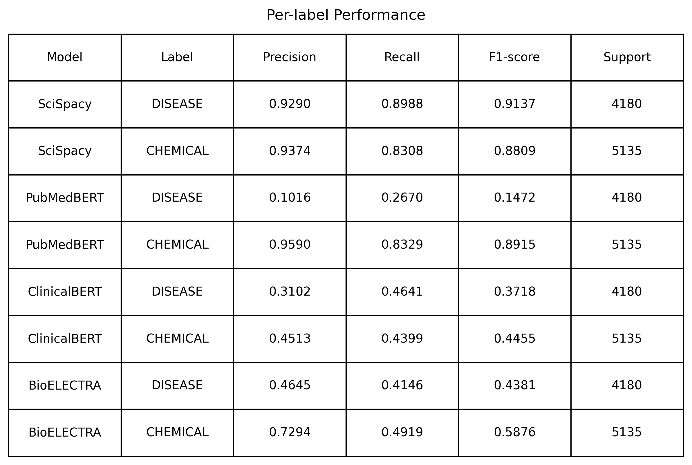
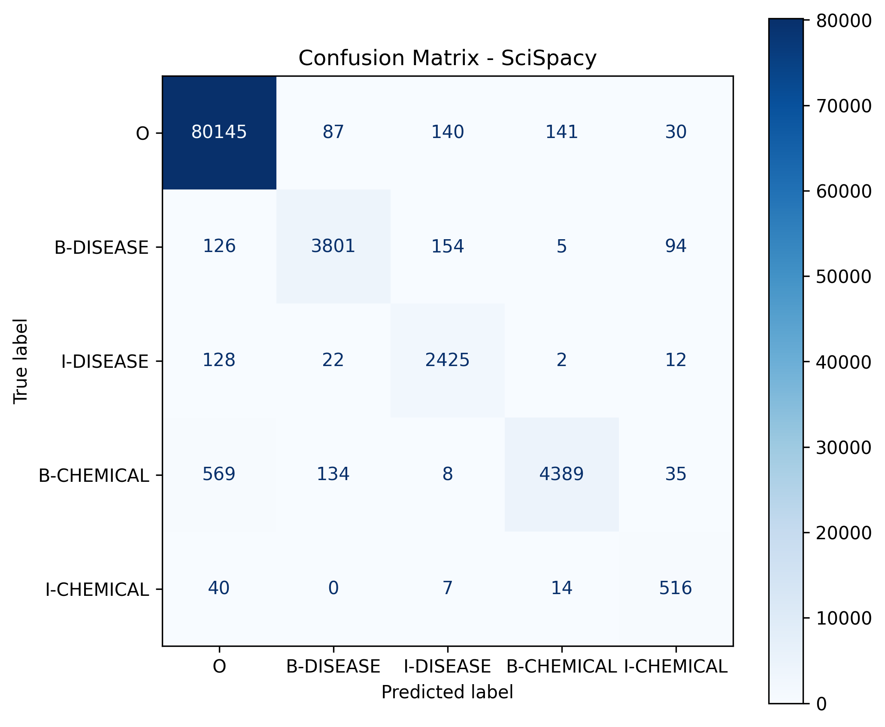
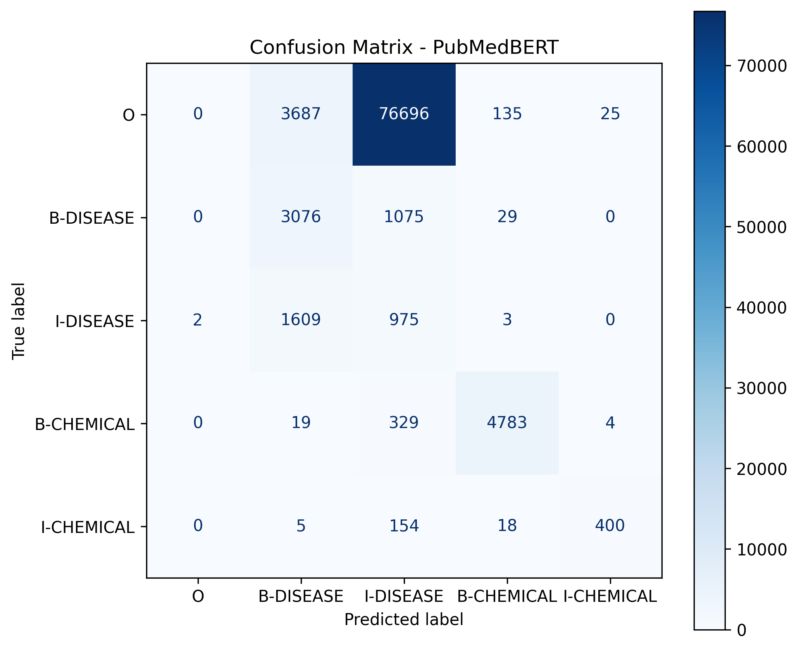
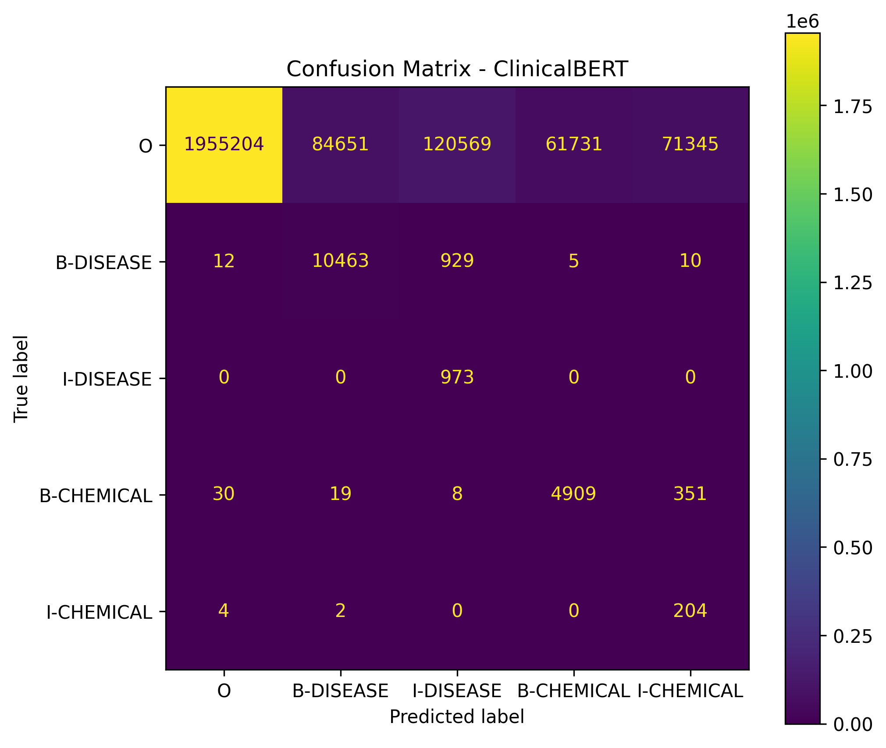
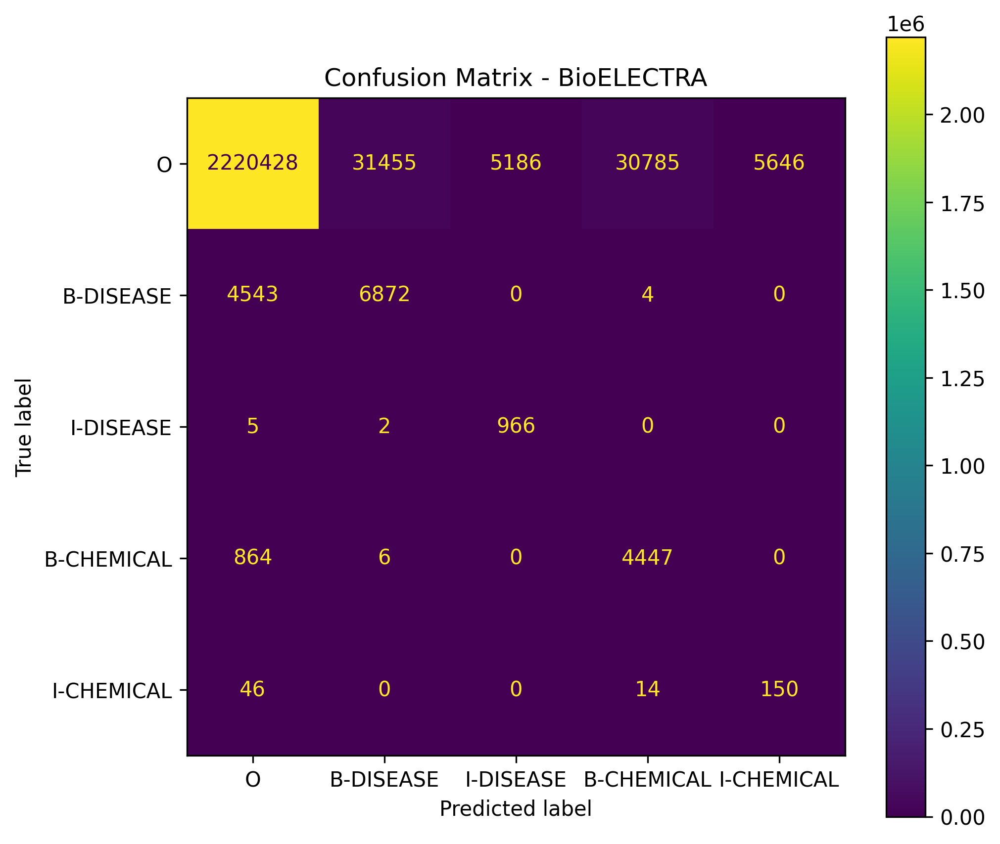

[](https://doi.org/10.5281/zenodo.18928352)

# Spatial Human Anatomy — Biomedical NER from Clinical Notes

This project explores how **clinical narratives can be transformed into structured biomedical information**, forming the foundation for **clinical knowledge graphs and spatial reasoning over human anatomy**.

Clinical notes contain valuable medical knowledge but are typically stored as **unstructured text**. Extracting entities such as **diseases** and **chemicals** is a critical first step toward building structured healthcare intelligence systems.

This repository implements a **reproducible biomedical NLP pipeline** that:

- extracts biomedical entities
- compares multiple NER models
- constructs a candidate gold dataset
- benchmarks model performance against both pseudo and human gold standards

---

# Project Goals

- Extract biomedical entities from clinical narratives  
- Compare classical and transformer-based biomedical NER models  
- Construct a **candidate gold dataset using model agreement**  
- Benchmark models against both:
  - candidate gold (pseudo labels)
  - human-annotated BC5CDR dataset  
- Prepare structured data for **knowledge graph construction**

---

# Project Pipeline
Raw Clinical Notes / BC5CDR Dataset
↓
Text Processing
↓
Biomedical Named Entity Recognition
├── SciSpacy
├── PubMedBERT
├── ClinicalBERT
└── BioELECTRA
↓
Entity Aggregation
↓
Candidate Gold Construction (≥ 3 models agree)
↓
BIO Conversion
↓
Benchmark Evaluation (seqeval)
↓
Structured Biomedical Entities

---

# Dataset

## BC5CDR (BioCreative V)

This project uses the **BC5CDR dataset**, a widely used biomedical benchmark containing:

- Disease entities
- Chemical entities
- Human-annotated ground truth

This enables **true evaluation against gold-standard annotations**, unlike scraped datasets.

---

# Biomedical NER Models

## SciSpacy
Model: `en_ner_bc5cdr_md`

- Fast inference
- High recall
- Lower precision

---

## PubMedBERT
Model: `BiomedNLP-PubMedBERT`

- Context-aware transformer model
- Strong precision
- Slow runtime

---

## ClinicalBERT
Model: `bert-base-uncased_clinical-ner`

- Designed for clinical text
- High recall
- Over-predicts entities

---

## BioELECTRA
Model: `d4data/biomedical-ner-all`

- Balanced performance
- Good precision-recall trade-off
- Efficient inference

---

# Candidate Gold Dataset

Since real-world clinical datasets often lack labels, we simulate supervision using **model agreement**.

### Method

- Combine predictions from 4 models:
  - SciSpacy
  - PubMedBERT
  - ClinicalBERT
  - BioELECTRA

- Build a voting table:
(row_id, text, start_char, end_char, label)


- Accept entity if:


≥ 3 models agree


This produces:


candidate_gold_entities.jsonl


---

# Evaluation Method

Evaluation follows standard biomedical NER practice:

### Steps

1. Load documents and entity predictions  
2. Group by `row_id`  
3. Convert spans → BIO labels  
4. Evaluate using **seqeval**

---

# BIO Conversion Example

Text:
The patient has asthma and takes aspirin


Tokens:


["The", "patient", "has", "asthma", "and", "takes", "aspirin"]


Labels:


["O", "O", "O", "B-DISEASE", "O", "O", "B-CHEMICAL"]


---

# Results

## Candidate Gold vs Human Gold

- Precision: **~0.99**
- Recall: **~0.29**
- F1-score: **~0.45**

### Interpretation

- Extremely high precision → candidate gold is **very reliable**
- Low recall → many true entities are **missed**
- This confirms:
  > Majority voting produces **high-confidence but incomplete labels**

---

## Model Performance (vs Candidate Gold)

| Model         | Precision | Recall | F1-score |
|--------------|----------|--------|----------|
| SciSpacy     | 0.32     | 0.99   | 0.48     |
| PubMedBERT   | 0.15     | 0.81   | 0.25     |
| ClinicalBERT | 0.22     | 0.88   | 0.35     |
| BioELECTRA   | 0.31     | 0.81   | 0.45     |

---

## Key Observations

- **SciSpacy** → highest recall, lowest precision  
- **PubMedBERT** → struggles with disease detection  
- **ClinicalBERT** → over-predicts entities  
- **BioELECTRA** → best balance overall  

---

# Per-label Performance

| Model | Label     | Precision | Recall | F1 |
|------|----------|----------|--------|----|
| SciSpacy | DISEASE | 0.2792 | 0.9843 | 0.4350 |
| SciSpacy | CHEMICAL | 0.3555 | 0.9939 | 0.5237 |
| PubMedBERT | DISEASE | 0.0595 | 0.5702 | 0.1078 |
| PubMedBERT | CHEMICAL | 0.3590 | 0.9834 | 0.5260 |
| ClinicalBERT | DISEASE | 0.1581 | 0.8622 | 0.2672 |
| ClinicalBERT | CHEMICAL | 0.2917 | 0.8968 | 0.4402 |
| BioELECTRA | DISEASE | 0.2482 | 0.8073 | 0.3797 |
| BioELECTRA | CHEMICAL | 0.3829 | 0.8145 | 0.5209 |

---

# Visual Results

## Candidate Gold vs Human Gold


## Model Performance Comparison


## Runtime Comparison


## Per-label Performance


---

# Confusion Matrices

## Candidate Gold vs Human Gold


## SciSpacy


## PubMedBERT


## ClinicalBERT


## BioELECTRA


---

# Runtime Analysis

| Model | Avg Time per Note |
|------|------------------|
| SciSpacy | 0.05s |
| PubMedBERT | 6.34s |
| ClinicalBERT | ~0.15s |
| BioELECTRA | ~0.15s |

### Insight

- SciSpacy → fastest  
- PubMedBERT → very slow  
- Transformers → moderate  

---

# Running the Project

### Install

```bash
pip install -r requirements/base.txt

python -m src.pipeline
python -m src.nerspacey
python -m src.biobert_bc5cdr
python -m src.clinicalbert_bc5cdr
python -m src.bioelectra_bc5cdr
```
Build candidate gold
```
python -m src.candidate_gold_bc5cdr
```
Run evaluation
```
python -m src.evaluate_bc5cdr

```
data/
├── raw/bc5cdr/
├── processed/bc5cdr/
│   ├── docs.jsonl
│   ├── gold_bio.jsonl
│   ├── candidate_gold_entities.jsonl
│   └── model outputs
figure/
src/
├── graph.py
├── evaluate_bc5cdr.py
├── candidate_gold_bc5cdr.py
├── ner pipelines
docs/

Future Work
Entity normalization (UMLS / SNOMED)
Knowledge graph construction
Graph neural networks for reasoning
Multimodal biomedical learning
Clinical decision support systems
Research Impact

This project demonstrates:

How to build pseudo-label datasets
Trade-offs between precision vs recall
Practical challenges in biomedical NER benchmarking

It forms a strong foundation for:

Biomedical NLP research + clinical knowledge graph systems
